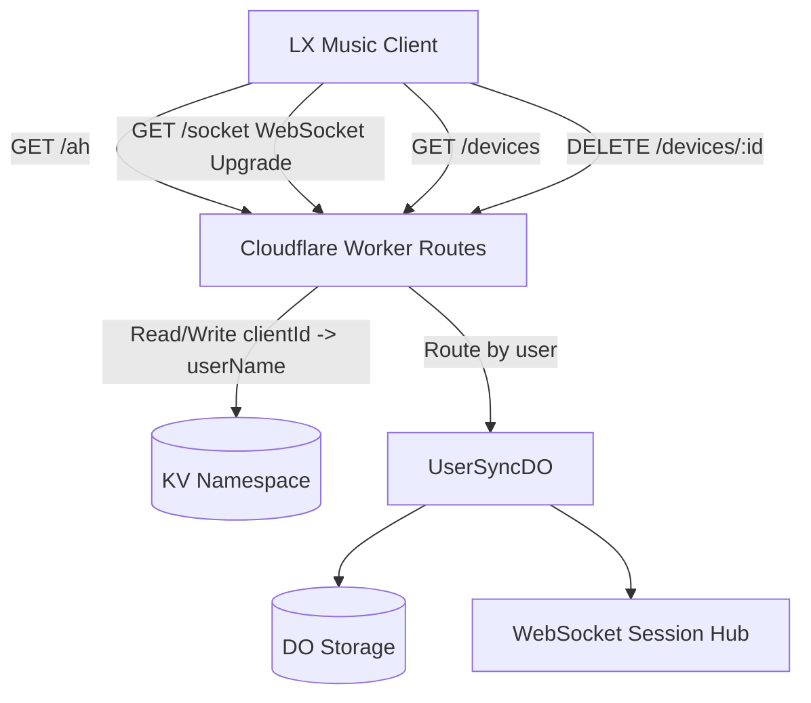

# lx-music-server

[](https://github.com/WorkerHub/lx-music-server/actions/workflows/deploy.yml)
[](LICENSE)
[](https://workers.cloudflare.com/)
[](https://pnpm.io/)

A Cloudflare Workers rewrite of [`lx-music-sync-server`](https://github.com/lyswhut/lx-music-sync-server), using Durable Objects for stateful WebSocket synchronization.

Built for one goal: run multi-device sync without self-hosting servers.

[English](README.en.md) ｜ [中文](README.md)

## Table of Contents

- [Why This Version](#why-this-version)
- [Deployment Guide](#deployment-guide)
- [Client Configuration](#client-configuration)
- [Device Management API](#device-management-api)
- [Local Development](#local-development)
- [Architecture](#architecture)
- [FAQ](#faq)
- [License](#license)

## Why This Version

- Serverless operations on Cloudflare Workers + Durable Objects
- Strong user isolation with one DO instance per user
- Real-time two-way sync for playlists and dislike rules
- Snapshot-based incremental merge across multiple devices
- Fast rollout via GitHub Actions

## Deployment Guide

### 1. Create a Cloudflare KV Namespace

1. Log in to [Cloudflare Dashboard](https://dash.cloudflare.com/)
2. Go to **Workers & Pages -> KV**
3. Click **Create a namespace**
4. Enter a name (for example, `lx-music-kv`) and create it
5. Copy the **Namespace ID** from the namespace detail page

### 2. Create a Cloudflare API Token

1. Log in to [Cloudflare Dashboard](https://dash.cloudflare.com/)
2. Go to **My Profile -> API Tokens** (or visit https://dash.cloudflare.com/profile/api-tokens)
3. Click **Create Token**
4. Choose **Edit Cloudflare Workers** template
5. Make sure permissions include:
  - Account / Workers Scripts / Edit
  - Account / Workers KV Storage / Edit
  - Account / Durable Objects / Edit
6. (Optional) Restrict resources to one account
7. Create the token and save it securely (shown only once)

### 3. Configure GitHub Actions in your fork

In **Settings -> Secrets and variables -> Actions**, add:

Secrets:

| Name | Description |
|---|---|
| `CLOUDFLARE_API_TOKEN` | API token from step 2 |
| `LX_USERS` | User config list |

Variables:

| Name | Description |
|---|---|
| `KV_NAMESPACE_ID` | KV namespace ID |

### 4. Configure users (`LX_USERS`)

Two input formats are supported.

Simple format (comma-separated `username:password` pairs):

```text
admin:your_password,alice:her_password
```

JSON format (with extra options):

```json
[{"name":"admin","password":"your_password"},{"name":"alice","password":"her_password","maxSnapshotNum":30}]
```

Supported fields:

| Field | Type | Description |
|---|---|---|
| `name` | string | Username (required) |
| `password` | string | Password (required) |
| `maxSnapshotNum` | number | Max snapshot retention, default 20 |
| `list.addMusicLocationType` | `"top"` \| `"bottom"` | Song insert position, default `"bottom"` |

To add or update users, change `LX_USERS` only. No code change is needed.

### 5. Trigger deployment

Open **Actions -> Deploy to Cloudflare Workers -> Run workflow**.

If you update Secrets, trigger deployment again manually.

### 6. Access URL

Default URL example:

```text
https://lx-music-server.<your-subdomain>.workers.dev
```

You can also bind a custom domain at `Settings -> Domains & Routes -> Custom Domain`.

Before migrating from another sync server, back up local client data first.

## Client Configuration

In LX Music sync settings:

- Server URL: `https://<your-worker-name>.<your-subdomain>.workers.dev` (or custom domain)
- Password: password for that user

## Device Management API

All endpoints use Basic Auth (same user credentials as sync login).

List authorized devices:

```bash
curl -u <username>:<password> https://<worker-url>/devices
```

Revoke a device:

```bash
curl -u <username>:<password> -X DELETE https://<worker-url>/devices/<clientId>
```

## Local Development

```bash
pnpm install
pnpm dev
```

`wrangler types` is integrated in scripts, so type definitions are generated before dev/deploy.

Manual deploy:

```bash
pnpm deploy
```

## Architecture



Key dependencies:

| Dependency | Purpose |
|---|---|
| [Hono](https://hono.dev) | HTTP routing framework |
| [message2call](https://github.com/lyswhut/message2call) | WebSocket RPC |
| [aes-js](https://github.com/ricmoo/aes-js) | AES encryption |
| [@noble/hashes](https://github.com/paulmillr/noble-hashes) | Hash implementation |

## FAQ

### 1. Deployment failed. What should I check first?

Check GitHub Actions config placement first:

- `KV_NAMESPACE_ID` must be in **Variables**
- `CLOUDFLARE_API_TOKEN` and `LX_USERS` must be in **Secrets**

If Variables and Secrets are mixed up, deployment will fail.

### 2. I changed `LX_USERS`, but users did not update. Why?

After changing Secrets, run the deployment workflow again.

### 3. Deployment succeeded but client cannot connect. What to check first?

Check these first:

- Worker URL in client settings
- Username/password consistency with `LX_USERS`
- `KV_NAMESPACE_ID` matches the correct Cloudflare account

### 4. Can I use only the default `workers.dev` domain?

Yes. Custom domain is optional.

### 5. Any migration advice from old sync servers?

Back up local data before switching server URL.

## License

[MIT](LICENSE)