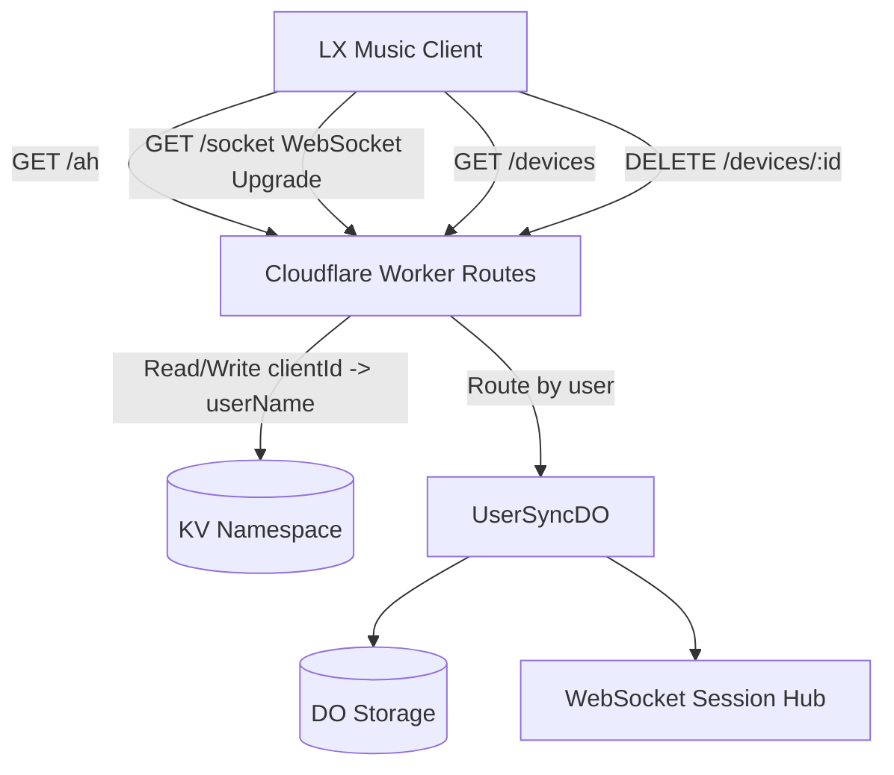

# lx-music-server

[](https://github.com/WorkerHub/lx-music-server/actions/workflows/deploy.yml)
[](LICENSE)
[](https://workers.cloudflare.com/)
[](https://pnpm.io/)

`lx-music-sync-server` 的 Cloudflare Workers 重构版，基于 Durable Objects 提供有状态 WebSocket 同步。

核心目标：不用自托管服务器，也能稳定做多设备实时同步。

[English](README.en.md) ｜ [中文](README.md)

## 目录

- [为什么选这个版本](#为什么选这个版本)
- [5 分钟快速开始](#5-分钟快速开始)
- [完整部署指南](#完整部署指南)
- [客户端配置](#客户端配置)
- [设备管理 API](#设备管理-api)
- [本地开发](#本地开发)
- [技术架构](#技术架构)
- [FAQ](#faq)
- [License](#license)

## 为什么选这个版本

- 无服务器运维：Cloudflare Workers + Durable Objects
- 多用户隔离：每个用户独立 DO 实例和存储
- WebSocket 实时同步：歌单和不喜欢规则双向同步
- 快照合并：支持多设备增量同步和冲突处理
- 一键部署：配合 GitHub Actions 可以快速上线

## 5 分钟快速开始

只想先跑起来，可以按这个最短路径：

1. Fork 本仓库
2. 在 Cloudflare 创建一个 KV Namespace，拿到 `KV_NAMESPACE_ID`
3. 在 Cloudflare 创建 API Token（Workers Scripts/KV/DO 都要 Edit 权限）
4. 在 GitHub 仓库配置：
  - Secret: `CLOUDFLARE_API_TOKEN`
  - Secret: `LX_USERS`
  - Variable: `KV_NAMESPACE_ID`
5. 在 Actions 手动运行 `Deploy to Cloudflare Workers`

`LX_USERS` 最小示例：

```text
admin:your_password,alice:her_password
```

## 完整部署指南

### 1. 创建 Cloudflare KV Namespace

1. 登录 [Cloudflare Dashboard](https://dash.cloudflare.com/)
2. 进入 **Workers & Pages -> KV**
3. 点击 **Create a namespace**
4. 输入名称（如 `lx-music-kv`）并创建
5. 在详情页复制 **Namespace ID**

### 2. 创建 Cloudflare API Token

1. 登录 [Cloudflare Dashboard](https://dash.cloudflare.com/)
2. 进入 **My Profile -> API Tokens**（或访问 https://dash.cloudflare.com/profile/api-tokens）
3. 点击 **Create Token**
4. 选择 **Edit Cloudflare Workers** 模板
5. 确认权限至少包含：
  - Account / Workers Scripts / Edit
  - Account / Workers KV Storage / Edit
  - Account / Durable Objects / Edit
6. （可选）将账户范围限制到指定账号
7. 点击 **Create Token** 并复制保存（只显示一次）

### 3. Fork 后配置 GitHub Actions

在仓库 **Settings -> Secrets and variables -> Actions** 中添加：

Secrets（敏感信息）：

| 名称 | 说明 |
|---|---|
| `CLOUDFLARE_API_TOKEN` | 上一步创建的 API Token |
| `LX_USERS` | 用户配置（见下一节） |

Variables（非敏感配置）：

| 名称 | 说明 |
|---|---|
| `KV_NAMESPACE_ID` | KV Namespace ID |

### 4. 配置用户（LX_USERS）

支持两种格式。

简单格式（用户名:密码，逗号分隔）：

```text
admin:your_password,alice:her_password
```

JSON 格式（可扩展选项）：

```json
[{"name":"admin","password":"your_password"},{"name":"alice","password":"her_password","maxSnapshotNum":30}]
```

支持的用户字段：

| 字段 | 类型 | 说明 |
|---|---|---|
| `name` | string | 用户名（必填） |
| `password` | string | 密码（必填） |
| `maxSnapshotNum` | number | 快照最大保留数，默认 20 |
| `list.addMusicLocationType` | `"top"` \| `"bottom"` | 新歌曲插入位置，默认 `"bottom"` |

修改用户只需要更新 `LX_USERS`，不需要改代码。

### 5. 触发部署

在仓库 **Actions -> Deploy to Cloudflare Workers -> Run workflow** 手动触发。

更新 Secret 后，需要再次手动触发部署。

### 6. 访问地址

默认地址示例：

```text
https://lx-music-server.<your-subdomain>.workers.dev
```

也可以绑定自定义域名（`Settings -> Domains & Routes -> Custom Domain`）。

更换同步服务器前，建议先做本地数据备份。

## 客户端配置

在 LX Music 客户端同步设置填写：

- 服务器地址：`https://<your-worker-name>.<your-subdomain>.workers.dev`（或自定义域名）
- 连接码：该用户对应密码

## 设备管理 API

使用 Basic Auth（与同步账号相同的用户名和密码）。

查询已授权设备：

```bash
curl -u <username>:<password> https://<worker-url>/devices
```

删除指定设备：

```bash
curl -u <username>:<password> -X DELETE https://<worker-url>/devices/<clientId>
```

## 本地开发

```bash
pnpm install
pnpm dev
```

项目已将 `wrangler types` 集成到脚本中，开发和部署前会自动生成类型定义。

手动部署：

```bash
pnpm deploy
```

## 技术架构



主要依赖：

| 依赖 | 用途 |
|---|---|
| [Hono](https://hono.dev) | HTTP 路由框架 |
| [message2call](https://github.com/lyswhut/message2call) | WebSocket RPC |
| [aes-js](https://github.com/ricmoo/aes-js) | AES 加解密 |
| [@noble/hashes](https://github.com/paulmillr/noble-hashes) | 哈希实现 |

## FAQ

### 1. 我改了 `LX_USERS` 但没有生效？

改 Secret 之后需要重新触发一次 GitHub Actions 部署。

### 2. 部署后连接失败应该先查什么？

优先检查：

- Worker URL 是否填对
- 用户名和密码是否和 `LX_USERS` 一致
- `KV_NAMESPACE_ID` 与 Cloudflare 账号是否对应

### 3. 可以只用 Workers 默认域名吗？

可以，默认 `workers.dev` 域名即可正常使用。

### 4. 迁移旧服务前有什么建议？

先备份客户端本地数据，再切换服务器地址，降低丢数据风险。

## License

[MIT](LICENSE)